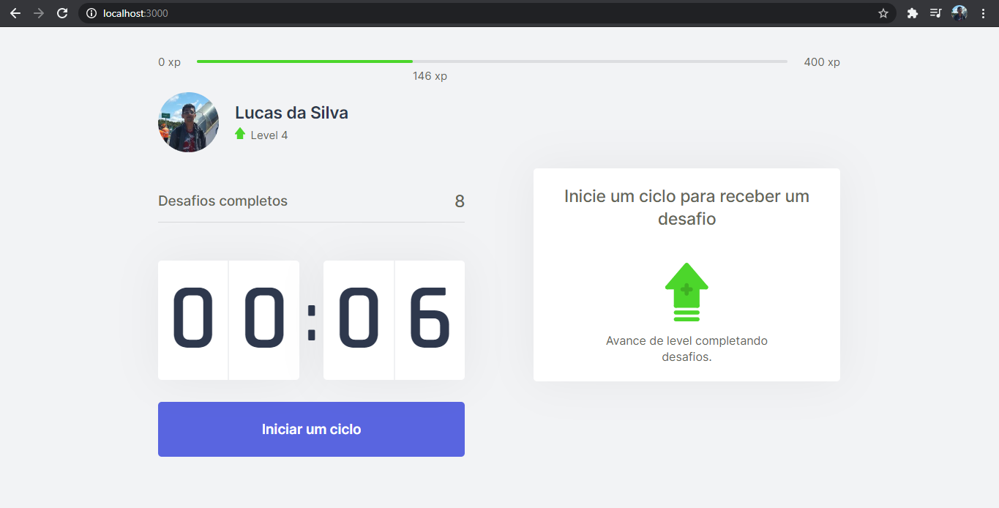

# :blue_book: Moveit - Usando Next_Js :computer:

## A Next_Level_Week#4, ao contrário das anteriores, alterou a dinâmica do ensino, dividindo esta semana em blocos: React_Js/Next_Js, Node_Js/Back-end, Elixir/Back-end. Assim, escolhi a trilha React/Next para evoluir meus conhecimentos sobre Next_Js, pois seu poder no mercado vem crescendo consideravelmente.

## O projeto totalmente React da NLW # 4 tem como prioridade alertar os desenvolvedores sobre o uso intensivo de computadores e incentivando-os a fazer exercícios físicos. Toda essa dinâmica foi estruturada com base em jogos, onde o Dev deve completar os exercícios para subir de nível.

## O projeto possui apenas uma página web, que representa o painel do aplicativo. Todo este projeto gira em torno do Context, pois existem muitas interações entre os componentes dos sistemas. Next_Js atua na administração de caminhos, onde as pastas principais (pages, styles e public) representam uma rota, por exemplo, 'icons/level.svg' onde a imagem esta na pasta principal public. Desta forma, as páginas do sistema ficam alocadas na pasta de pages, porém, neste local possui 3 arquivos e apenas 1 é uma página. Isso ocorre porque _app.tsx e _document.tsx são usados para "regular" algumas configurações para todas as páginas do sistema. _App.tsx é usado para atribuir estilizações globais a todo o sistema, _document.tsx é usado para atribuir algumas configurações no arquivo .html gerado pelo Next_Js. O arquivo index.tsx contém toda a estrutura do projeto, organizando assim os componentes criados em uma única página, além disso, possui a função GetServerSideProps que se encarrega de ler algumas informações nos cookies do navegador.

## O arquivo Challenge Box.tsx é o componente que contém os desafios que o Dev deve realizar para poder fazer o upgrade. As informações sobre os desafio estão vinculadas ao arquivo ChanllengeContext porque ele analisa os dados no arquivo challenge.json e as repassa para os outros arquivos usando a função de context. O arquivo CompletedChalleges.tsx é um componente simples que apresenta o desafio total realizado pelo programador, esta informação é armazenada no cookie do navegador e repassada pelo contexto. O arquivo responsável por representar a contagem regressiva é CountDown.tsx, ele contém a divisão do tempo em minutos e segundos (linhas 13 e 14), o tempo é repassado pelo CountDownContext, além das funções que iniciam a contagem e seu cancelamento. ExperienceBar.tsx é a famosa barra de experiência de jogo, o aumento está diretamente vinculado aos pontos xp quando uma atividade é concluída com sucesso. O aumento da barra verde é efetuada usando o "style={{left: `${percentToNextLevel}%`}}" para avançar/aumentar.

